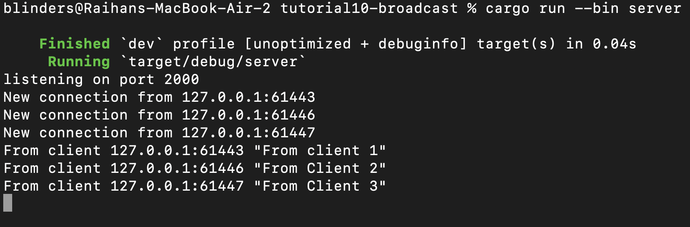
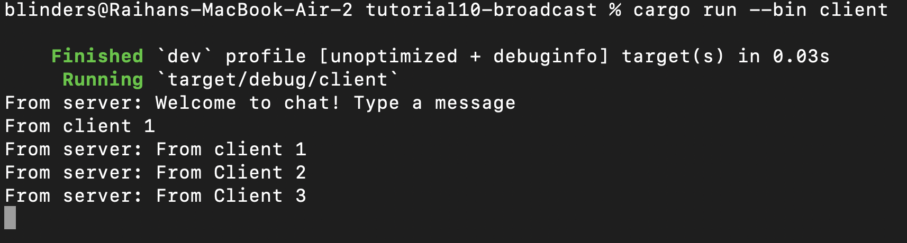
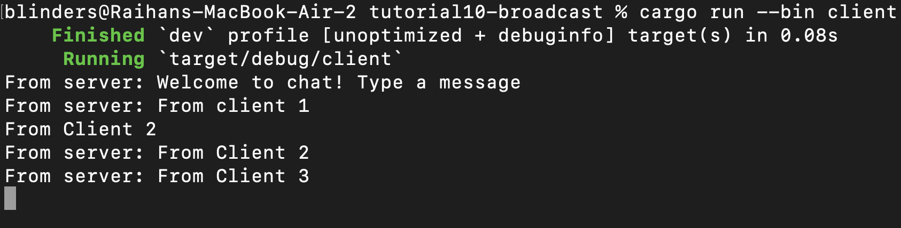
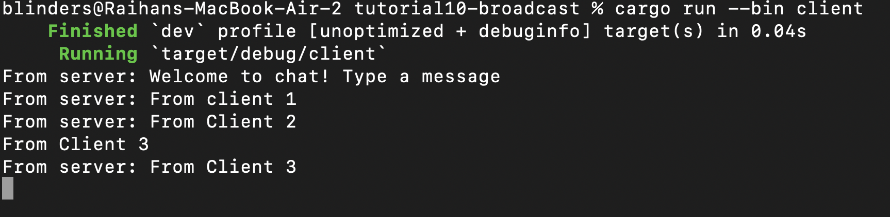

# Reflections

## 2.1. Original code of broadcast chat

### Server


### Client




To run for the server we type
```
cargo run --bin server
```
and for the client 
```
cargo run --bin client
```

Also because of this implementation is about websocket communication between client and server. So everytime client send any data to the server, the server will receive it and give back to any client it's currently connected to.

## 2.2. Modifying the websocket port
When we modify by changing the port number at `Server::bind` function in the server code. We also need to change the port number where the client connects to in the `Client::connect` function. Because if the ports of client and server diffrent when server for example waiting on port 8080 but client try to listen to port 2000, the connection on client will automatically refused. Because there is no websocket running on port 2000.